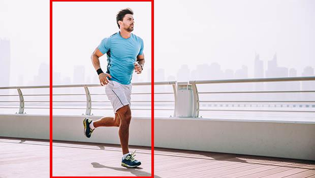
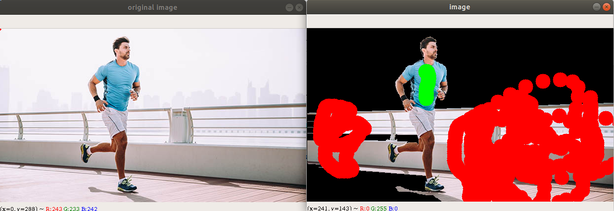
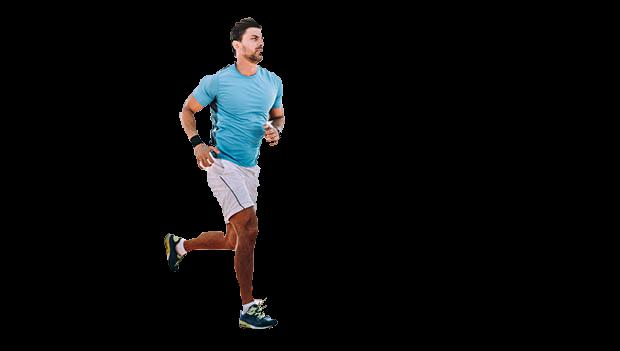

# Grabcutter
Interactive forground extractiong using  
a. bounding box  
b. user input brush/strokes

## Getting Started

Please refer to the walkthrough notebook GrabCutter.ipynb

## Example
In this example, we would like to crop out the runner in the image  


### method 1: Using a bounding box


### method 2: Using brush to specify foreground and background


### final outcome



```python

```
